# hardware-renderer-cpp

Vulkan renderer sandbox in C++ with a growing pile of graphics experiments.

This started as a clean educational hardware-rasterizer project. It has since
diverged into a broader graphics playground with lighting experiments, scene
tests, paint/deformation systems, batching work, and early virtualized-geometry
prototypes.

## Gallery

| | |
|---|---|
| 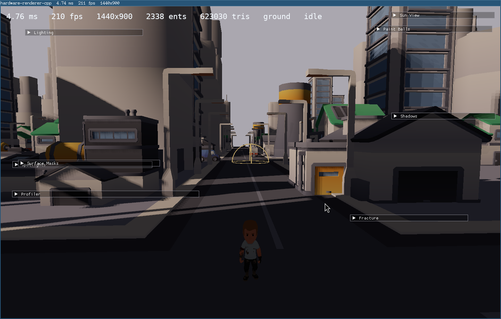 | 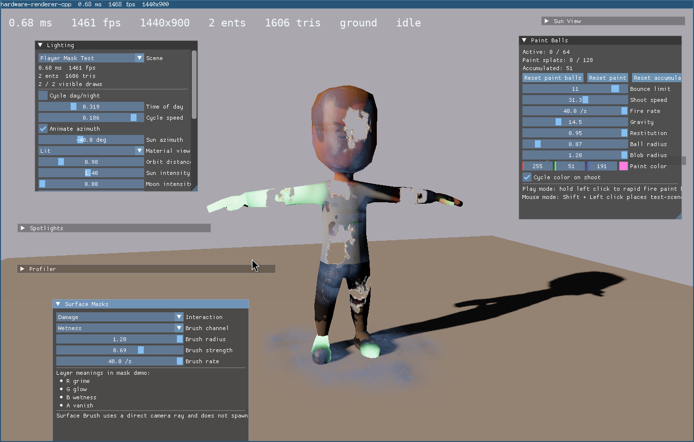 |
| 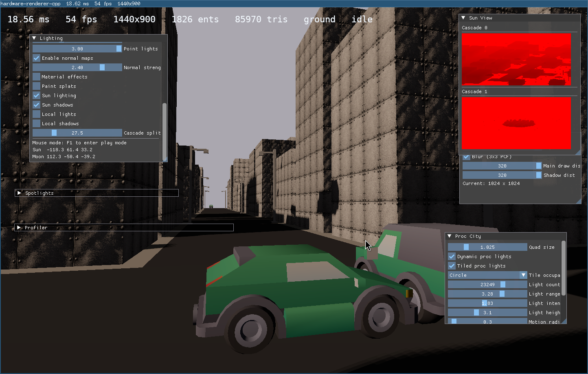 | 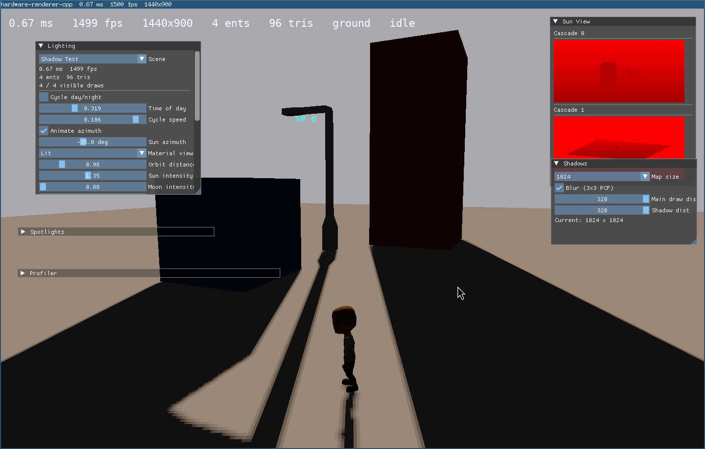 |
| 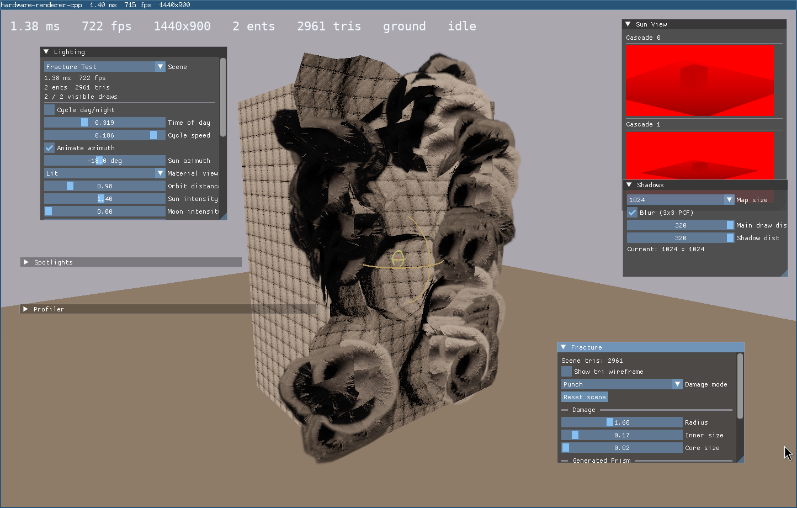 | 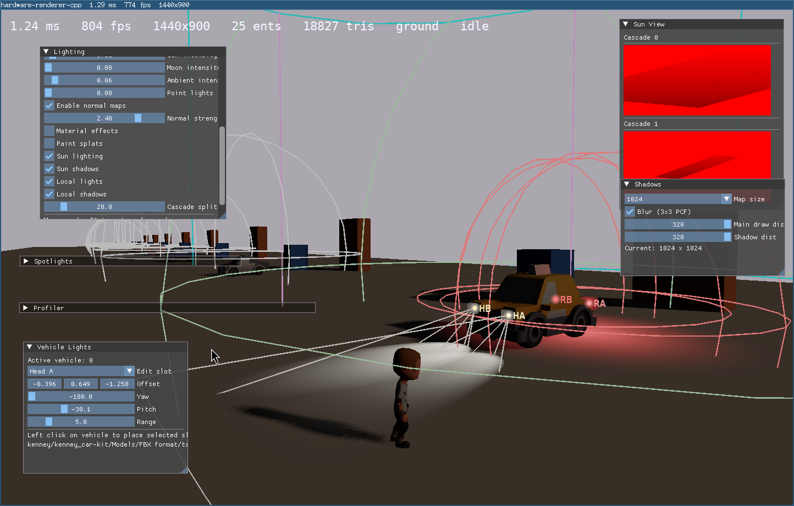 |
| 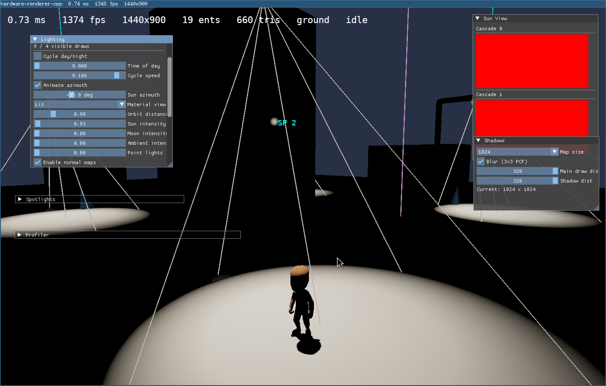 | 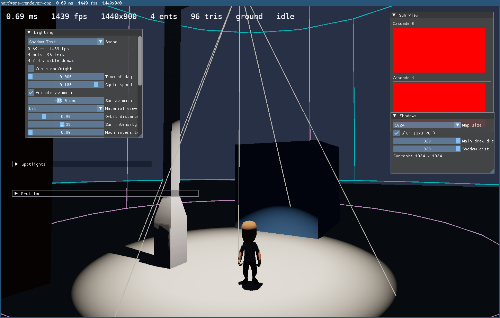 |
| 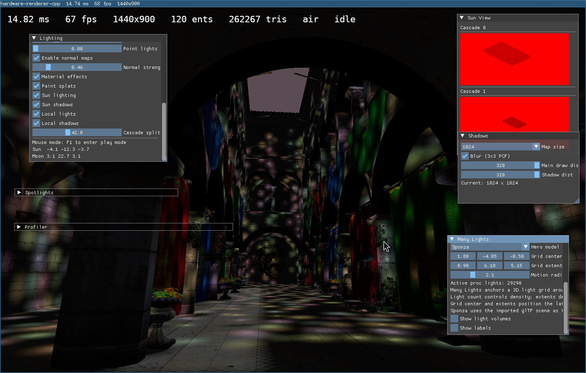 | 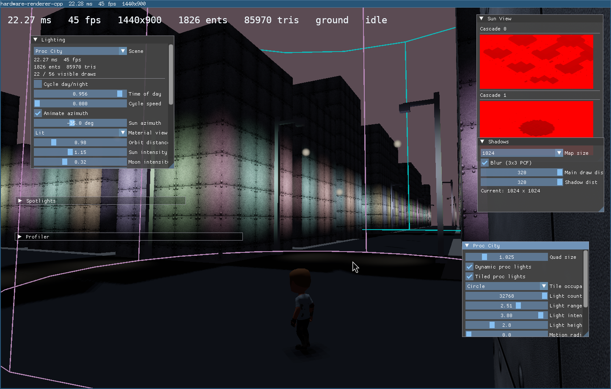 |
| 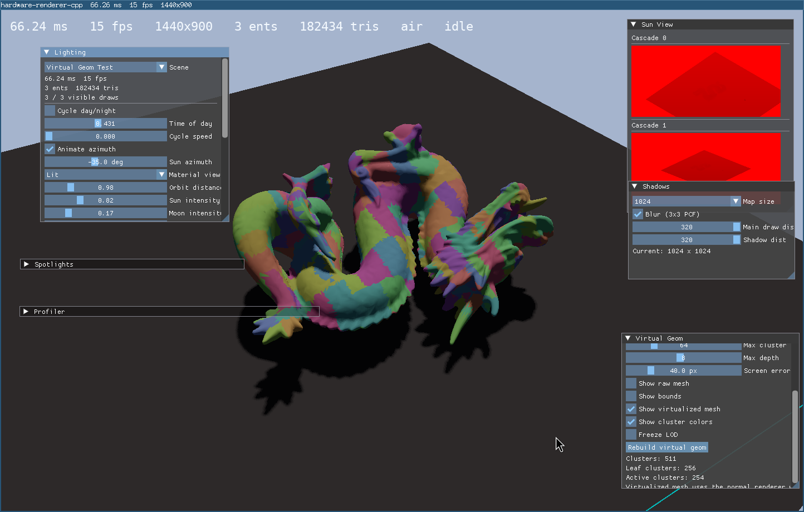 | |

## Current State

- CMake + Ninja build
- Clang-format and VS Code `F5` flow
- Vendored SDL3 through CMake `FetchContent`
- SDL3 floating Vulkan window on X11/i3
- Vulkan graphics pipeline with swapchain, depth buffer, and textured mesh rendering
- Third-person follow camera with right-mouse look
- OBJ, glTF, and FBX asset loading
- PNG texture loading
- Multi-model scene path with separate models and world instances
- Realtime hardware lighting in fragment shader
- Animated point light orbit
- CPU-side static triangle collider groundwork for scene queries
- Grounded player movement with jump, slide, and static-scene collision
- Kenney character load path with CPU clip evaluation and GPU skinning
- Native-resolution SDL_ttf HUD overlay
- Smoothed `ms / fps` in the window title
- Tiled proc-light path that scales to large dynamic light counts
- Dedicated light-tile and many-lights stress scenes
- `Virtual Geom Test` for cluster-selection and virtualized-geometry experiments

## Important Note

The renderer currently has a known regression in the main static-batched scene
mesh path.

As a correctness fallback, some scenes are currently rendered through the
single-draw path instead of the intended batched path. That keeps scenes
visible, but it means some performance comparisons are not final yet.

See:

- [`docs/static-batching-regression.md`](/home/vega/Coding/Graphics/hardware-renderer-cpp/docs/static-batching-regression.md)

## Build

```bash
cmake --preset debug
cmake --build --preset debug
./build/debug/hardware-renderer-cpp
```

## Assets

Downloaded Kenney packs are expected under `assets/kenney/`.

Use the fetch script from the repo root:

```bash
./scripts/fetch_kenney_assets.sh
```

With no arguments, it fetches the Kenney packs this project currently uses:

- `animated-characters-1`
- `city-kit-commercial`
- `city-kit-industrial`
- `city-kit-roads`
- `city-kit-suburban`
- `car-kit`

You can still pass explicit Kenney page slugs if you want extra packs:

```bash
./scripts/fetch_kenney_assets.sh food-kit cube-pets
```

The script unpacks assets under `assets/kenney/`, preserving Kenney's archive folder names. The code currently expects roots like:

```text
assets/kenney/animated-characters-1/
assets/kenney/kenney_city-kit-commercial_2.1/
assets/kenney/kenney_city-kit-industrial_1.0/
assets/kenney/kenney_city-kit-roads/
assets/kenney/kenney_city-kit-suburban_20/
assets/kenney/kenney_car-kit/
```

Small repo-owned assets that are not downloaded packs, such as
[`assets/waterdrops.png`](/home/vega/Coding/Graphics/hardware-renderer-cpp/assets/waterdrops.png),
are intended to stay checked into git.

Larger demo assets are fetched on demand and ignored in git.

Fetch helpers currently in the repo:

- [`scripts/fetch_kenney_assets.sh`](/home/vega/Coding/Graphics/hardware-renderer-cpp/scripts/fetch_kenney_assets.sh)
- [`scripts/fetch_sponza_optimized.sh`](/home/vega/Coding/Graphics/hardware-renderer-cpp/scripts/fetch_sponza_optimized.sh)
- [`scripts/fetch_dragon_attenuation.sh`](/home/vega/Coding/Graphics/hardware-renderer-cpp/scripts/fetch_dragon_attenuation.sh)

## VS Code

Open the `hardware-renderer-cpp` folder and press `F5`.

That configures, builds, and launches `build/debug/hardware-renderer-cpp` under `gdb`.

## Controls

- `F1`: toggle play mode / mouse mode
- `W A S D`: move
- `Space`: jump or fly up depending on scene
- `Shift`: sprint, fly down, or placement modifier depending on scene
- `Escape`: release mouse first, then quit

## Scenes

The repo now contains multiple scene and testbed types instead of one canonical
sample scene:

- character/world scenes
- city and proc-city scenes
- light-tile and many-lights stress scenes
- vehicle-light test scenes
- virtualized-geometry test scenes

Some of these are “real” scenes and some are pure renderer/debug labs.

## What It Teaches

- how Vulkan graphics setup differs from a software rasterizer
- how mesh, material, texture, and scene-instance data get uploaded into GPU resources
- how a hardware raster pipeline is split across CPU setup, vertex shader, fragment shader, and presentation
- how a CPU-side static world collider can sit next to a GPU renderer without contaminating the render architecture
- how to keep a renderer flat and explicit without dragging simulation/gameplay concerns into it
- how renderer experiments can accumulate technical debt if they are not
  separated back out again

## Docs

- `docs/current-renderer-walkthrough.md`: file map and frame flow
- `docs/roadmap.md`: where this renderer would naturally go next
- `docs/features.md`: target feature set for the bigger castle/character direction
- `docs/rearchitecture-notes.md`: what should be split and cleaned up before the repo grows much more
- `docs/rendering-scalability-notes.md`: why the current forward path slows down and what to optimize next
- `docs/light-culling-notes.md`: how global vs local lights should be culled in the current renderer
- `docs/clustered-lighting-notes.md`: how clustered light lookup works in a raster pipeline
- `docs/paint-systems-notes.md`: intended split between transient splats and persistent texture-backed paint
- `docs/paint-uv-generation-notes.md`: offline-generated secondary UVs for persistent paint and layered material masks
- `docs/world-paint-volume-notes.md`: sparse chunked 3D world-space paint volume idea for UV-independent persistence
- `docs/deformation-and-decal-eval.md`: evaluation of current mesh damage code and why decals should become a real dedicated system
- `docs/flat-decal-system-spec.md`: spec for the dedicated flat quad decal system and its renderer constraints
- `docs/module-cleanup-notes.md`: cleanup note for moving damage, decals, and sound out of `App` and into dedicated modules
- `docs/ideas.md`: gameplay and renderer experiment backlog for this sandbox
- `docs/static-batching-regression.md`: current bug note for the broken main static-batched mesh path

## Status

This is no longer just a tiny starter renderer. It is now a mixed codebase with:

- one real Vulkan scene renderer
- several renderer stress scenes and debug scenes
- lighting scalability experiments
- paint/deformation/decal experiments
- virtualized-geometry experiments
- some known regressions and rough edges from moving fast

That makes it more useful as a renderer lab, but less minimal than the original
intent.

If the repo keeps growing, the next valuable step is not only more features. It
is also cleanup:

- restore the broken static batching path
- separate experimental systems more cleanly
- make benchmark scenes reproducible
- decide which experiments are permanent features and which are temporary labs
